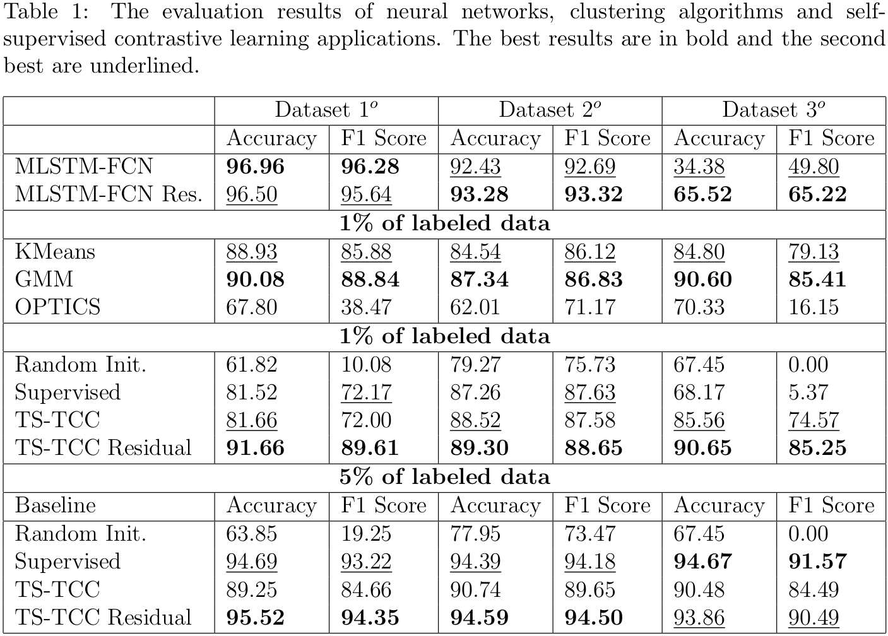

# Machine-learning_Residual_Applications

This repository is the official implementation of **_On residual component applications in nonlinear time series classification using machine learning methods_**.

## Abstract
This paper presents a study on the application of the residual component in nonlinear time series classification using machine learning models. Such models are trained on a certain set of parameters of the nonlinear dynamical systems. Because of the sensitive dependence on the initial conditions of such systems, the accuracy of machine learning models drops drastically when the parameters change. It is one of the examples of the concept drift problem. As an illustrative example, we provide a problem of the computation of the two-parameter bifurcation diagrams for the oscillatory time series (periodic or chaotic/quasi-periodic) obtained as solutions for nonlinear systems of ordinary differential equations. The paper is divided into three parts. Firstly we improved the generalization ability of the Multivariate LSTM-FCN model, by extracting and training the model on the residual component of the time series, which improved the accuracy almost by 31%. The steps applied are generic and can be reapplied to any other machine learning method. Secondly, we show that by taking the residual component's mean and variance, we can extract many very interesting features of the two-parameter bifurcation diagrams using the KMeans, GMM, and OPTICS clustering algorithms, and by applying a simple algorithm we can transform the obtained clusters into classification method. Lastly, we used a self-supervised contrastive learning approach to reconstruct two-parameter bifurcation diagrams applying the scaling and residual components as data augmentation techniques. By using only 1% of the dataset labels we reconstructed the diagrams with an accuracy of about 94%.

## Requirmenets:

To install requirements:
```setup
conda env create -f environment.yml
```
or if you want to update existing conda enviroment:

```setup_v2
conda env update -f environment.yml
```
We used public dataset in this study:
- [Electric Arc Dataset](https://drive.google.com/drive/folders/19fb0V4TLiVvetVPA3bNpmBsiqbGQ_cUV?usp=sharing)

## Training

To train the MLSTM-FCN networks in the paper, run the following commands:
- model trained on original time-series data
```train
python train.py --labels_data labels_L_1.txt --x_data x_data.pickle --y_data y_data.pickle --z_data z_data.pickle
```
- model trained on residual components
```train_2
python train.py --labels_data labels_L_1.txt --x_data residual_x.pickle --y_data residual_y.pickle --z_data residual_z.pickle --save_file_name checkpoint_residual
```

As for clustering algorithms you should run the following commands:
```train_3
python GaussianMixtureModel_xyz_clustering_train.py --residual_x_var_mean residual_x_var_mean.pickle --residual_y_var_mean residual_y_var_mean.pickle --residual_z_var_mean residual_z_var_mean.pickle --out_labels gmm --out_model gmm
python kmeans_xyz_clustering_train.py --residual_x_var_mean residual_x_var_mean.pickle --residual_y_var_mean residual_y_var_mean.pickle --residual_z_var_mean residual_z_var_mean.pickle --out_labels kmeans --out_model kmeans
python OPTICS_xyz_clustering_train.py --residual_x_var_mean residual_x_var_mean.pickle --residual_y_var_mean residual_y_var_mean.pickle --residual_z_var_mean residual_z_var_mean.pickle --out_labels OPTICS --out_model OPTICS
```

The default values provided in training scripts were the one used in paper.

## Training TS-TCC 
You can select one of several training modes:
 - Random Initialization (random_init)
 - Supervised training (supervised)
 - Self-supervised training (self_supervised)
 - Fine-tuning the self-supervised model (fine_tune)
 - Training a linear classifier (train_linear)

The code allows also setting a name for the experiment, and a name of separate runs in each experiment.
It also allows the choice of a random seed value.

To use these options:
```
python main.py --experiment_description exp1 --run_description run_1 --seed 123 --training_mode random_init --selected_dataset arc
```
Note that the name of the dataset should be the same name as inside the "data" folder, and the training modes should be
the same as the ones above.

To train the model for the `fine_tune` and `train_linear` modes, you have to run `self_supervised` first.

## Evaluation

To evaluate MLSTM-FCN models:
- firstly generate predicted probabilities for time-series data where L=1.0:
```eval
python mlstm_fcn_predict_prob.py --labels_data labels_L_1.txt --x_data x_data.pickle --y_data y_data.pickle --z_data z_data.pickle --checkpoint checkpoint_trainloss_0.078_trainaccuracy_0.97_validloss_0.073_validaccuracy_0.973_epoch_192.pth --predicted_prob_labels model_mlstm_fcn_L1_epoch_192_ps.pickle
python mlstm_fcn_predict_prob.py --labels_data labels_L_1.txt --x_data residual_x.pickle --y_data residual_y.pickle --z_data residual_z.pickle --checkpoint checkpoint_residual_trainloss_0.097_trainaccuracy_0.963_validloss_0.097_validaccuracy_0.963_epoch_188.pth --predicted_prob_labels model_residual_mlstm_fcn_L1_epoch_188_ps.pickle
```
- next run the following command to evaluate the trained models for time-series data where L=1.0:
```eval2
python eval.py --labels_data labels_L_1.txt --predicted_prob_labels model_mlstm_fcn_L1_epoch_192_ps.pickle
python eval.py --labels_data labels_L_1.txt --predicted_prob_labels model_residual_mlstm_fcn_L1_epoch_188_ps.pickle
```
- for time-series data where L=1.1 firstly run:
```eval3
python mlstm_fcn_predict_prob.py --labels_data labels_L_1_1.txt --x_data x_data_L_1_1.pickle --y_data y_data_L_1_1.pickle --z_data z_data_L_1_1.pickle --checkpoint checkpoint_trainloss_0.078_trainaccuracy_0.97_validloss_0.073_validaccuracy_0.973_epoch_192.pth --predicted_prob_labels model_mlstm_fcn_L_1_1_epoch_192_ps.pickle
python mlstm_fcn_predict_prob.py --labels_data labels_L_1_1.txt --x_data residual_x_L_1_1.pickle --y_data residual_y_L_1_1.pickle --z_data residual_z_L_1_1.pickle --checkpoint checkpoint_residual_trainloss_0.097_trainaccuracy_0.963_validloss_0.097_validaccuracy_0.963_epoch_188.pth --predicted_prob_labels model_residual_mlstm_fcn_L_1_1_epoch_188_ps.pickle
```
- next run:
```eval4
python eval.py --labels_data labels_L_1_1.txt --predicted_prob_labels model_mlstm_fcn_L1_1_epoch_192_ps.pickle
python eval.py --labels_data labels_L_1_1.txt --predicted_prob_labels model_residual_mlstm_fcn_L1_1_epoch_188_ps.pickle
```
- for time-series data where RCL firstly run:
```eval5
python mlstm_fcn_predict_prob.py --labels_data labels_RCL.txt --x_data x_data_RCL.pickle --y_data y_data_RCL.pickle --z_data z_data_RCL.pickle --checkpoint checkpoint_trainloss_0.078_trainaccuracy_0.97_validloss_0.073_validaccuracy_0.973_epoch_192.pth --predicted_prob_labels model_mlstm_fcn_RCL_epoch_192_ps.pickle
python mlstm_fcn_predict_prob.py --labels_data labels_RCL.txt --x_data residual_x_RCL.pickle --y_data residual_y_RCL.pickle --z_data residual_z_RCL.pickle --checkpoint checkpoint_residual_trainloss_0.097_trainaccuracy_0.963_validloss_0.097_validaccuracy_0.963_epoch_188.pth --predicted_prob_labels model_residual_mlstm_fcn_RCL_epoch_188_ps.pickle
```
- finally run:
```eval6
python eval.py --labels_data labels_RCL.txt --predicted_prob_labels model_mlstm_fcn_RCL_epoch_192_ps.pickle
python eval.py --labels_data labels_RCL.txt --predicted_prob_labels model_residual_mlstm_fcn_RCL_epoch_188_ps.pickle
```

To evaluate clustering algorithms:
- run the following commands
```eval7
python GaussianMixtureModel_xyz_clustering_postprocessing.py --labels_data labels_L_1.txt --model_labels gmm --out_fig gmm
python kmeans_xyz_clustering_postprocessing.py --labels_data labels_L_1.txt --model_labels kmeans --out_fig kmeans
python OPTICS_xyz_clustering_postprocessing.py --labels_data labels_L_1.txt --model_labels OPTICS --out_fig OPTICS
```
- and to turn it to classification problem and generate metrics:
```eval8
python GaussianMixtureModel_xyz_clustering_postprocessing_classification.py --labels_data labels_L_1.txt --model_labels gmm --out_fig gmm
python kmeans_xyz_clustering_postprocessing_classification.py --labels_data labels_L_1.txt --model_labels kmeans --out_fig kmeans
python OPTICS_xyz_clustering_postprocessing_classification.py --labels_data labels_L_1.txt --model_labels OPTICS --out_fig OPTICS

## Results
Our model achieves the following performance metrics:


## License
Licensed under [The MIT License](https://opensource.org/licenses/MIT).

## Citation
If you found this work useful for you, please consider citing it.

## Contact
For any issues/questions regarding the paper or reproducing the results, please contact me.   
Salama Hassona  
Opole University of Technology, Opole, Opolskie, Poland.    
Email: salama.hassona{at}gmail.com  
